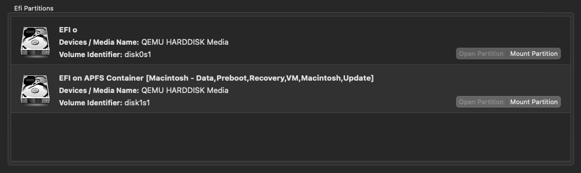
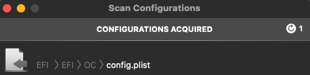

# Setting up OSX-KVM with UNRAID (Unraid OS)
Note: SpaceInvaderOne has a community app called `macinabox`, and it is a Docker container that can automate the entire process that creates the VM and disks. This guide aims to provide utility in choosing specific macOS versions or bootloaders, and understanding the process of how this repository's resources can be used in hypervisor types (UNRAID, ESXi, etc.).

- [Setting up OSX-KVM with UNRAID](#setting-up-osx-kvm-with-unraid)
  - [Motivation](#motivation)
  - [Pre-Requisites](#pre-requisites)
  - [Preparing the VM](#preparing-the-vm)
  - [Starting the VM](#starting-the-vm)
  - [Optional Notes](#optional-notes)
  - [Misc](#misc)
  - [Resources](#resources)

## Motivation
This guide solely uses the files generated from this repository to construct a VM for use in UNRAID. This means updates to and features of this repository should be compatible with creating VMs in UNRAID. This type of setup also aims to utilize UNRAID's advantages to address items in the [Contributing Back](https://github.com/kholia/OSX-KVM#contributing-back) section of the main repository, including creating/re-using VM snapshots, build farms, VNC+SSH support, and capacity of delivering a bare-metal-like experience for development. Further customization in setting up Hackintosh on KVM is beyond the scope of this documentation, but feel free to provide relevant [supplemental resources](#resources).

## Pre-Requisites
Follow the [Installation Preparation](https://github.com/kholia/OSX-KVM#installation-preparation) guide and have your disk image `mac_hdd_ng.img` and installation media `BaseSystem.dmg` ready.

Ensure you have VM support and passthrough parameters prepared (VFIO devices, PCI controllers, VNC remote, etc.). You should also have a way of reading/writing to the appropriate locations in your UNRAID server (I use `Krusader`).

## Preparing the VM
Below are sample instructions for setting up the VM. We will keep the necessary files in the same directory for simplicity.
* Place these 3 files `BaseSystem.img`, `mac_hdd_ng.img` and `OSX-KVM/OpenCore/OpenCore.qcow2` into the directory of your VM
  * ie: Into `/mnt/user/domains/BigSur`, where domains is the folder for your VMs
* Create a new VM and edit the XML. Use the OSX-KVM repository's `macOS-libvirt-Catalina.xml` as a guide
  * ie: You also have the option to use the GUI to adjust the CPUs, RAM, setting the OS installation media and disk images, as well as the devices you wish to pass into the VM. However, each time the template is edited via the GUI, you must go in the XML editor and paste the qemu args at the bottom of the XML file.
  * Note: The opencore qcow2 file should be prioritized first, it will contain the EFI boot partition that you can modify after installation using the OpenCore Configurator
* Check that the three files' primary vDisk bus is SATA, and verify types:
  * OpenCore.qcow2 `<driver name='qemu' type='qcow2' cache='writeback'/>`
  * BaseSystem.img `<driver name='qemu' type='raw' cache='writeback'/>`
  * mac_hdd_ng.img `<driver name='qemu' type='qcow2' cache='writeback'/>`
* After successful installation, the BaseSystem.img entry can be safely deleted from the XML

## Starting the VM
* Initialize the VM, and select the macOS base system when OpenCore prompts
* Once the installer boots, go into disk utility and erase the qemu drive that relatively matches the space you've allocated in the qemu-img args
  * ie: Erase the disk and use these params - APFS, GUID Partition Table
* After installation, you may need to change the NIC to `vmxnet3` or `e1000-82545em` to login with your Apple ID or install your apps from the AppStore (consult [Resources](#resources) for other network interface types)
* Download OpenCore Configurator and mount the EFI partition called `EFI o` (Tools > Mount EFI)

* Open the plist from Tools > Scan Configurations

* Customize aml/kext/nvram/drivers and save
  * Note: Making modifications here will write to the `OpenCore.qcow2` file copied from this repository.

## Optional Notes
In no particular order,
* For the RX 5700XT, the boot-args `agdpmod=pikera` is necessary to successfully boot. Change in `NVRAM > UUID > boot-args (right-click) > WhateverGreen > agdpmod=pikera`
  * Use VNC or another GPU until able to configure the EFI partition, or pre-configure the qcow2 file
* Simplify updates by creating another VM template that does not passthrough the GPU (noVNC)
  * During OS updates, multiple restarts occur. If you use an AMD GPU that has the reset-bug, this process can be jarring
  * Each restart there will be another boot option alongside your default one (from the update), choose that one until the update is complete
* For passing PCIe USB controllers. ensure they work with macOS and ensure its free by vfio-bind them on server boot

When there is a home for this section, feel free to share optimizations and configurations that require modifications to the qemu args, XML, config plist, etc.

## Misc

qemu args
```
  <qemu:commandline>
    <qemu:arg value='-usb'/>
    <qemu:arg value='-device'/>
    <qemu:arg value='usb-kbd,bus=usb-bus.0'/>
    <qemu:arg value='-device'/>
    <qemu:arg value='isa-applesmc,osk=ourhardworkbythesewordsguardedpleasedontsteal(c)AppleComputerInc'/>
    <qemu:arg value='-smbios'/>
    <qemu:arg value='type=2'/>
    <qemu:arg value='-cpu'/>
    <qemu:arg value='Penryn,kvm=on,vendor=GenuineIntel,+invtsc,vmware-cpuid-freq=on,+pcid,+ssse3,+sse4.2,+popcnt,+avx,+aes,+xsave,+xsaveopt,check'/>
  </qemu:commandline>
```

## Resources

* [https://forums.unraid.net/topic/84430-hackintosh-tips-to-make-a-bare-metal-macos/](https://forums.unraid.net/topic/84430-hackintosh-tips-to-make-a-bare-metal-macos/)
* [SpaceInvaderOne: How to Easily Install macOS Catalina Mojave or HighSierra as a VM on Unraid](https://www.youtube.com/watch?v=g_jk9D2e5q0)
* [Macinabox GitHub Repository](https://github.com/SpaceinvaderOne/Macinabox)
