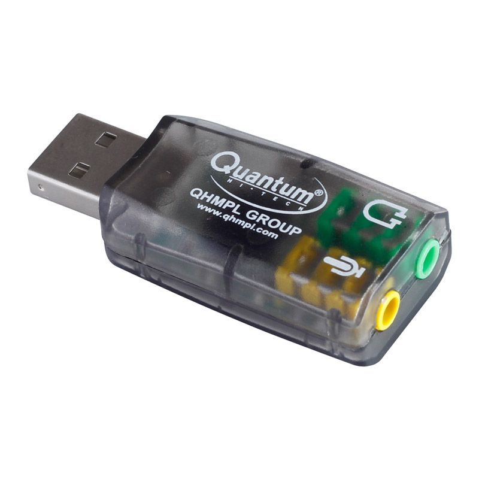

### macOS Sonoma support

- Change `Penryn` to `Haswell-noTSX` in OpenCore-Boot.sh file.

- This worked fine even on a `AMD Ryzen 9 5900HS` CPU.

### App Store problems

Do you see the "Your device or computer could not be verified" message when you
try to login to the App Store? If yes, here are the steps to fix it.

- Make sure that your wired ethernet connection is called "en0" (and not "en1"
  or something else). Use "ifconfig" command to verify this.

- If the wired ethernet connection is not called "en0", then then go to Network
  in System Preferences and delete all the devices, and apply the changes.
  Next, go to the console and type in `sudo rm /Library/Preferences/SystemConfiguration/NetworkInterfaces.plist`.
  Finally reboot, and then use the App Store without problems.

This fix was found by `Glnk2012` of https://www.tonymacx86.com/ site.

Also tweaking the `smbios.plist` file can help (?).

### Resolution in Ventura

Update: Switching to `vmware-svga` device seems to have "fixed" the following
problem!

...

From https://superuser.com: macOS Ventura screen resolution settings includes
only 3 predefined options but choosing any of them breaks my installation (I'm
getting black screen with only small portion visible).

Process to reset the resolution (using that small visible) display portion:

Log in (in a blind fashion!), open Terminal and run the following commands:

```
sudo rm /Library/Preferences/com.apple.windowserver.plist

rm ~/Library/Preferences/ByHost/com.apple.windowserver*

sudo reboot
```

Reboot the macOS Ventura VM.

Note: Running `displayplacer "id:FFFFFFFF-FFFF-FFFF-FFFF-FFFFFFFFFFFF mode:10"`
doesn't help with this resolution problem on macOS Ventura.

### Change resolution in OpenCore

```diff
diff --git a/OpenCore/config.plist b/OpenCore/config.plist
index 4754e8c..489570f 100644
--- a/OpenCore/config.plist
+++ b/OpenCore/config.plist
@@ -692,7 +692,7 @@
                        <key>Resolution</key>
-                       <string>Max</string>
+                       <string>1920x1080</string>
```

Ensure that the OVMF resolution is set equal to resolution set in your OpenCore
qcow2 file (default is 1024x768). This can be done via the OVMF menu, which you
can reach with a press of the ESC button during the OVMF boot logo (before
OpenCore boot screen appears). In the OVMF menu settings, set Device Manager ->
OVMF Platform Configuration -> Change Preferred Resolution for Next Boot to the
desired value (default is 1024x768). Commit changes and exit the OVMF menu.

Note: The macOS VM's resolution can be changed via `Settings -> Displays`
option easily.

Note: After changing the `config.plist` file, please regenerate the
`OpenCore.qcow2` file using the [instructions](./OpenCore/README.md#notes)
included in this repository.

### GPU passthrough notes

These steps will need to be adapted for your particular setup. A host machine
with IOMMU support is required. Consult [this Arch Wiki article](https://wiki.archlinux.org/title/PCI_passthrough_via_OVMF)
for general-purpose guidance and details.

I am running Ubuntu 22.04.4 LTS on Intel i5-6500 + ASUS Z170-AR motherboard +
AMD RX 6600 GPU (April 2024).

- Blacklist the required kernel modules.

  ```
  $ cat /etc/modprobe.d/blacklist.conf
  ... <existing stuff>

  blacklist amdgpu
  blacklist radeon
  ```

- Find details of the PCIe devices to passthrough.

  ```
  $ lspci -nnk | grep AMD
  01:00.0 VGA compatible controller [0300]: Advanced Micro Devices, Inc. [AMD/ATI] Ellesmere [Radeon RX 470/480/570/570X/580/580X/590] [1002:67df] (rev ef)
  01:00.1 Audio device [0403]: Advanced Micro Devices, Inc. [AMD/ATI] Ellesmere HDMI Audio [Radeon RX 470/480 / 570/580/590] [1002:aaf0]
  ```

- Enable IOMMU support and configure VFIO.

  Append the given line to `GRUB_CMDLINE_LINUX_DEFAULT` in `/etc/default/grub`.

  ##### Intel CPU Systems

  `iommu=pt intel_iommu=on vfio-pci.ids=1002:67df,1002:aaf0 kvm.ignore_msrs=1 video=vesafb:off,efifb:off`

  ##### AMD CPU Systems

  `iommu=pt amd_iommu=on <remaining-line-from-above...>`

- Tweak module configuration a bit according to the following output (thanks to Mathias Hueber).

  ```
  $ cat /etc/modprobe.d/vfio.conf
  options vfio-pci ids=1002:67df,1002:aaf0 disable_vga=1
  softdep radeon pre: vfio-pci
  softdep amdgpu pre: vfio-pci
  softdep nouveau pre: vfio-pci
  softdep drm pre: vfio-pci
  ```

- Update GRUB, initramfs, and then reboot.

  ```
  sudo update-grub2

  sudo update-initramfs -k all -u
  ```

- In the BIOS setup, set the `Primary Display` to `IGFX` (aka CPU graphics / onboard graphics).

  Tip: Update the BIOS!

- Verify that the IOMMU ("VT-d" for Intel) is enabled, and `vfio-pci` is
  working as expected. Verify that the expected devices are using `vfio-pci` as
  their kernel driver.

  ```
  $ dmesg | grep -i iommu
  [    0.076879] DMAR: IOMMU enabled
  [    0.183732] DMAR-IR: IOAPIC id 2 under DRHD base  0xfed91000 IOMMU 1
  [    0.330654] iommu: Default domain type: Passthrough (set via kernel command line)
  [    0.489615] pci 0000:00:00.0: Adding to iommu group 0
  [    0.489627] pci 0000:00:01.0: Adding to iommu group 1
  [    0.489634] pci 0000:00:02.0: Adding to iommu group 2
  [    0.489643] pci 0000:00:14.0: Adding to iommu group 3
  ```

  ```
  $ dmesg | grep vfio
  [    0.526198] vfio-pci 0000:01:00.0: vgaarb: changed VGA decodes: olddecodes=io+mem,decodes=io+mem:owns=io+mem
  [    0.543768] vfio_pci: add [1002:67df[ffffffff:ffffffff]] class 0x000000/00000000
  [    0.563765] vfio_pci: add [1002:aaf0[ffffffff:ffffffff]] class 0x000000/00000000
  [    3.384597] vfio-pci 0000:01:00.0: vgaarb: changed VGA decodes: olddecodes=io+mem,decodes=io+mem:owns=io+mem
  ```

  ```
  $ lspci -nkk -d 1002:67df
  01:00.0 0300: 1002:67df (rev ef)
          Subsystem: 1da2:e366
          Kernel driver in use: vfio-pci
          Kernel modules: amdgpu
  ```

  ```
  $ ./scripts/list_iommu_groups.sh
  IOMMU Group 0:
          00:00.0 Host bridge [0600]: Intel Corporation Xeon E3-1200 v5/E3-1500 v5/6th Gen Core Processor Host Bridge/DRAM Registers [8086:191f] (rev 07)
  IOMMU Group 1:
          00:01.0 PCI bridge [0604]: Intel Corporation Xeon E3-1200 v5/E3-1500 v5/6th Gen Core Processor PCIe Controller (x16) [8086:1901] (rev 07)
          01:00.0 VGA compatible controller [0300]: Advanced Micro Devices, Inc. [AMD/ATI] Ellesmere [Radeon RX 470/480/570/570X/580/580X/590] [1002:67df] (rev ff)
          01:00.1 Audio device [0403]: Advanced Micro Devices, Inc. [AMD/ATI] Ellesmere HDMI Audio [Radeon RX 470/480 / 570/580/590] [1002:aaf0] (rev ff)
   ```

- Fix permissions for the `/dev/vfio/1` device (modify as needed):

  ```
  sudo cp vfio-kvm.rules /etc/udev/rules.d/vfio-kvm.rules

  sudo udevadm control --reload
  sudo udevadm trigger
  ```

- Open `/etc/security/limits.conf` file and add the following lines:

  ```
  @kvm            soft    memlock         unlimited
  @kvm            hard    memlock         unlimited
  @libvirt        soft    memlock         unlimited
  @libvirt        hard    memlock         unlimited
  ```

  Thanks to `Heiko Sieger` for this solution.

- Confirm the contents of `boot-passthrough.sh` and run it to boot macOS with
  GPU passthrough.

- To reuse the keyboard and mouse devices from the host, setup "Automatic
  login" in System Preferences in macOS and configure Synergy software.

Note: On `Pop!_OS`, use the `kernelstub` command to change the kernel boot
arguments.

Note 2: Use [AMD VBFlash](https://www.techpowerup.com/download/ati-atiflash/)
to dump the AMD GPU bios, and pass on to QEMU. This is especially required if
your AMD GPU is not starting up properly (resulting in "no signal" on the
monitor).

Tested GPUs: Sapphire AMD RX 6600 (RECOMMENDED!), ZOTAC GeForce GT 710 DDR3 (<=
Big Sur), Sapphire Radeon RX 570.

UPDATE: Project sponsors get access to the `Private OSX-KVM repository`, and
direct support. This private repository has a playbook to automate 95% of this
work in a rugged, consistent manner.

[Link to a list of supported GPUs](https://dortania.github.io/GPU-Buyers-Guide/modern-gpus/amd-gpu.html).

### USB passthrough notes

These steps will need to be adapted for your particular setup.

- Isolate the passthrough PCIe devices with vfio-pci, with the help of `lspci
  -nnk` command.

  ```
  $ lspci -nnk
  ...
  03:00.0 USB controller: ASMedia ASM1142 USB 3.1 Host Controller [1b21:1242]
  ```

  Add `1b21:1242` to `GRUB_CMDLINE_LINUX_DEFAULT` in `/etc/default/grub` file
  in the required format. See `GPU passthrough notes` (above) for details.

- Update initramfs, and then reboot.

  ```
  sudo update-initramfs -k all -u
  ```

- Use the helper scripts to isolate the USB controller.

  ```
  $ scripts/lsgroup.sh
  ### Group 7 ###
      00:1c.0 PCI bridge: Intel Corporation Sunrise ...
  ### Group 15 ###
      06:00.0 Audio device: Creative Labs Sound Core3D ...
  ### Group 5 ###
      00:17.0 SATA controller: Intel Corporation Sunrise ...
  ### Group 13 ###
      03:00.0 USB controller: ASMedia ASM1142 USB 3.1 Host Controller
  ```

  ```
  scripts/vfio-group.sh 13
  ```

- Add `-device vfio-pci,host=03:00.0,bus=pcie.0` line to `boot-passthrough.sh`.

- Boot the VM, and devices attached to the ASMedia USB controller should just work under macOS.

[Here is a link to a list of recommended USB PCIe cards](http://blog.greggant.com/posts/2018/05/07/definitive-mac-pro-upgrade-guide.html).

### Synergy Notes

- Get Synergy from https://sourceforge.net/projects/synergy-stable-builds.

  I installed "synergy-v1.8.8-stable-MacOSX-x86_64.dmg" on the macOS guest and
  configured it as a client.

  For automatically starting Synergy on macOS, add Synergy to "Login Items",
  System Preferences -> Users & Groups -> Select your user account -> Login Items
  -> Add a login item

- On the Linux host machine, install "synergy-v1.8.8-stable-Linux-x86_64.deb"
  or newer, configure `~/.synergy.conf` and run `synergys` command.

- The included `.synergy.conf` will need to be adapted according to your setup.

### Virtual Sound Device

https://github.com/chris1111/VoodooHDA-OC

This kext can be used on macOS 10.12 to macOS Big Sur 11.2 to get emulated
sound card working. Do NOT mix VoodooHDA with AppleALC. You may want to
consider HDA passthrough or USB sound card passthrough or use HDMI audio
instead.

Note: The emulated sound output can be choppy, and distorted. Use Sound Card /
USB Sound Card passthrough instead.

Note: It seems that playback of Flash videos requires an audio device to be
present.



This cheap(est) USB sound card works pretty well on macOS *without* requiring
USB-controller-passthrough.

### Building QEMU from source

See http://wiki.qemu-project.org/Hosts/Linux for help.

```
$ git clone https://github.com/qemu/qemu.git

$ cd qemu

$ mkdir build; cd build

$ ../configure --prefix=/home/$(whoami)/QEMU --enable-trace-backend=simple \
    --enable-debug --target-list=x86_64-softmmu,aarch64-softmmu --audio-drv-list=pa

$ make -j8; make install
```

### Connect iPhone / iPad to macOS guest

iDevices can be passed through in two ways: USB or USB OTA.

USB OTA:

https://github.com/corellium/usbfluxd

https://github.com/EthanArbuckle/usbfluxd-usage

VFIO USB Passthrough:

https://github.com/Silfalion/Iphone_docker_osx_passthrough

### Exposing AES-NI instructions to macOS

Add `+aes` argument to the `-cpu` option in `boot-macOS.sh` file.

``` diff
diff --git a/boot-macOS.sh b/boot-macOS.sh
index 5948b8a..3acc123 100755
--- a/boot-macOS.sh
+++ b/boot-macOS.sh
@@ -18,7 +18,7 @@
 # Use "-device usb-tablet" instead of "-device usb-mouse" for better mouse
 # behaviour. This requires QEMU >= 2.9.0.

-qemu-system-x86_64 -enable-kvm -m 3072 -cpu Penryn,kvm=off,vendor=GenuineIntel \
+qemu-system-x86_64 -enable-kvm -m 3072 -cpu Penryn,kvm=off,vendor=GenuineIntel,+aes \
          -machine pc-q35-2.4 \
          -smp 4,cores=2 \
          -usb -device usb-kbd -device usb-mouse \
```

Other host CPU features can be similarly exposed to the macOS guest.

The following command can be used on macOS to verify that AES-NI instructions are exposed,

```
sysctl -a | grep machdep.cpu.features
```

On machines with OpenSSL installed, the following two commands can be used to
check AES-NI performance,

```
openssl speed aes-128-cbc

openssl speed -evp aes-128-cbc  # uses AES-NI
```

### Exposing AVX and AVX2 instructions to macOS

Exposing AVX and AVX2 instructions to macOS requires support for these
instructions on the host CPU.

The `boot-clover.sh` script already exposes AVX and AVX2 instructions to the
macOS guest by default. Modify or comment out the `MY_OPTIONS` line in
`boot-clover.sh` file in case you are having problems.

To enable AVX2, do the following change,

`Clover boot menu -> Options -> Binaries patching -> Fake CPUID -> 0x0306C0  # for Haswell`

For details, see [this wiki](https://clover-wiki.zetam.org/Configuration/KernelAndKextPatches) page.

Once enabled, the following commands can be used to confirm the presence of AVX
and AVX2 instructions on the macOS guest.

```
$ sysctl -a | grep avx
hw.optional.avx2_0: 1
hw.optional.avx1_0: 1

$ sysctl -a | grep leaf7
machdep.cpu.leaf7_features: SMEP BMI1 AVX2 BMI2
machdep.cpu.leaf7_feature_bits: 424
```

### Enabling Hypervisor.Framework (Nested Virtualization / Docker for Mac / Android Emulator / etc)

Docker for Mac, the Android Emulator and other virtualization products require
nested virtualization in the form of the `Hypervisor Framework` to work on
macOS.

Use the `sysctl kern.hv_support` (output `1` is good) command to check if
`Hypervisor` is enabled within the macOS VM.

If `Hypervisor` is not enabled, check that you have the required CPU features.
Run the `sysctl -a | grep machdep.cpu.features` command and look for the
presence of `VMX` flag.

If the `VMX` flag is missing, use the following steps to enable it:

- Make sure that `kvm_intel` module is loaded properly. This is documented in our
  [main documentation](./README.md).

- Make sure the VM is booted with VMX support passed through using one of the
  two below strategies:

  You may add `vmx,rdtscp` arguments to the `-cpu` option in `boot-macOS.sh`
  file (easier option).

  You may add `+vmx,` to the front of `MY_OPTIONS` in the boot script while
  changing `-cpu Penryn` to `-cpu Skylake-Client` or [any other suitable supported CPU](https://manpages.ubuntu.com/manpages/disco/man7/qemu-cpu-models.7.html).

  Note: Host CPU passthrough is troublesome and not generally recommended.

Note: You may need to `Reset NVRAM` on the next reboot, but after that you
should see a `1` when you re-check `sysctl kern.hv_support`.

### Using virtio-blk-pci with macOS

Newer macOS (namely Mojave+) have support for some virtio drivers.

This can be enabled by applying the following change to `boot-macOS-NG.sh` to
get some performance gain.

```diff
-         -device ide-hd,bus=sata.4,drive=MacHDD \
+         -device virtio-blk-pci,drive=MacHDD \
```

### Permission problems with libvirt / qemu

```
sudo setfacl -m u:libvirt-qemu:rx /home/$USER
sudo setfacl -R -m u:libvirt-qemu:rx /home/$USER/OSX-KVM

In general,

sudo setfacl -R -m u:libvirt-qemu:rx <path>  # fix virt-manager perm problems
```

### Extract .pkg files

- http://mackyle.github.io/xar/ is unmaintained and may fail for many `.pkg` files.

- Use a modern version of `7-Zip` instead.

  ```
  7z l example.pkg

  7z x example.pkg

  gunzip -c <something>.pkg/Payload | cpio -i
  ```

### QEMU quits with `gtk initialization failed`

Append the `display=none` argument to your QEMU execution script (this has
already been done for `boot-passthrough.sh`)

### ISO/DMG (`createinstallmedia` generated) install medium not detected

In OpenCore's `config.plist` and set `ScanPolicy` to `0` ([For more information, check the Dortania Troubleshooting Guide](https://dortania.github.io/OpenCore-Install-Guide/troubleshooting/troubleshooting.html#can-t-see-macos-partitions))

### Attach physical drive to QEMU VM

Note: If using NVMe, passing the controller may be a better option then passing it as a block device.

Run `ls -la /dev/disk/by-id/` to get the unique mapping for the device you want to attach to the VM (like `sda`, `sdb`, `nvme0n1`, while you can attach only a partition like `sda1`, this is not recommended)

```
$ ls -la /dev/disk/by-id
total 0
drwxr-xr-x 2 root root 360 Jul 29 08:14 .
drwxr-xr-x 8 root root 160 Jul 29 08:14 ..
lrwxrwxrwx 1 root root   9 Jul 29 08:14 ata-ST2000FFFFF-FFFFFF_FFFFFFFF -> ../../sda
lrwxrwxrwx 1 root root  10 Jul 29 08:14 ata-ST2000FFFFF-FFFFFF_FFFFFFFF-part1 -> ../../sda1
lrwxrwxrwx 1 root root  10 Jul 29 08:14 ata-ST2000FFFFF-FFFFFF_FFFFFFFF-part2 -> ../../sda2
lrwxrwxrwx 1 root root  13 Jul 29 08:14 nvme-eui.ffffffffffffffff -> ../../nvme0n1
lrwxrwxrwx 1 root root  15 Jul 29 08:14 nvme-eui.ffffffffffffffff-part1 -> ../../nvme0n1p1
lrwxrwxrwx 1 root root  15 Jul 29 08:14 nvme-eui.ffffffffffffffff-part2 -> ../../nvme0n1p2
lrwxrwxrwx 1 root root  13 Jul 29 08:14 nvme-Samsung_SSD_960_EVO_512GB_FFFFFFFFFFFFFFF -> ../../nvme0n1
lrwxrwxrwx 1 root root  15 Jul 29 08:14 nvme-Samsung_SSD_960_EVO_512GB_FFFFFFFFFFFFFFF-part1 -> ../../nvme0n1p1
lrwxrwxrwx 1 root root  15 Jul 29 08:14 nvme-Samsung_SSD_960_EVO_512GB_FFFFFFFFFFFFFFF-part2 -> ../../nvme0n1p2
lrwxrwxrwx 1 root root   9 Jul 29 08:14 wwn-0xffffffffffffffff -> ../../sda
lrwxrwxrwx 1 root root  10 Jul 29 08:14 wwn-0xffffffffffffffff-part1 -> ../../sda1
lrwxrwxrwx 1 root root  10 Jul 29 08:14 wwn-0xffffffffffffffff-part2 -> ../../sda2
```

Then edit your QEMU launch script and add these lines (adapt to it your
hardware), then launch the script using `sudo` (because you cannot write to a
block device without `root` permissions)

```
-drive id=NVMeDrive,if=none,file=/dev/disk/by-id/nvme-Samsung_SSD_960_EVO_512GB_FFFFFFFFFFFFFFF,format=raw \
-device ide-hd,bus=sata.4,drive=NVMeDrive \
```

### Run the Virtual Machine on Boot

- Edit your QEMU launch script and set the absolute path of `OSX-KVM` as the
  value of `REPO_PATH`

- Edit `/etc/rc.local` and add the absolute path of the script (with or without
  `sudo` depending on your needs) to the bottom of the script.

### Setup SSH for internal remote access

Presuming your network interface has a statically defined internal IP (on Ubuntu).

```
sudo apt install openssh-server -y
sudo ufw allow ssh
sudo update-rc.d ssh defaults
sudo systemctl enable ssh
sudo systemctl enable ssh.socket
sudo systemctl enable ssh.service
```

### AMD GPU Notes

- https://www.nicksherlock.com/2020/11/working-around-the-amd-gpu-reset-bug-on-proxmox/

- Consider using CMMChris's [RadeonBoost.kext](https://forums.macrumors.com/threads/tired-of-low-geekbench-scores-use-radeonboost.2231366/)
  for the RX480, RX580, RX590 and Radeon VII GPUs.

### USB passthrough notes

#### USB 3.0 flash drive

The following USB configuration works for usb passthrough of a USB 3.0 flash
drive to Fedora 25 guest.

```
-device nec-usb-xhci,id=xhci \
-device usb-host,bus=xhci.0,vendorid=0x0781,productid=0x5590 \
-usb -device usb-mouse,bus=usb-bus.0 -device usb-kbd,bus=usb-bus.0 \
...
```

#### Moto G3 phone

The following USB configuration works for usb passthrough of a Moto G3 phone to
Fedora 25 guest.

```
    -device usb-host,bus=usb-bus.0,vendorid=0x22b8,productid=0x002e \
    -usb -device usb-mouse,bus=usb-bus.0 -device usb-kbd,bus=usb-bus.0 \
    ...
```

#### CoolerMaster keyboard

The following USB configuration works for usb passthrough of a CoolerMaster
keyboard to macOS Sierra guest!

```
    -device usb-host,bus=usb-bus.0,vendorid=0x2516,productid=0x0004 \
    -usb -device usb-tablet,bus=usb-bus.0 -device usb-kbd,bus=usb-bus.0 \
    ...
```

#### Virtual USB disk

The following USB configuration works for attaching a virtual USB disk to macOS
Sierra guest. Use "qemu-img" to create "disk.raw" virtual disk.

```
    -drive if=none,id=usbstick,file=disk.raw,format=raw \
    -device usb-storage,bus=usb-bus.0,drive=usbstick \
    ...
```

However USB passthrough of EHCI, and XHCI (USB 3.0) devices does not work with
macOS Sierra. See https://bugs.launchpad.net/qemu/+bug/1509336 for
confirmation. According to this bug report, USB passthrough does not work with
versions >= Mac OS X El Capitan guests.

It seems that this problem can be fixed by using OVMF + Clover.

Update: OVMF + Clover doesn't help. It seems that macOS is missing the required
drivers for the EHCI, and XHCI controllers that are exposed by QEMU.

### Generate macOS Mojave / Catalina installation ISO

  This step currently needs to be run on an existing macOS system.

  ```
  cd ~/OSX-KVM/scripts

  ./create_dmg_catalina.sh
  ```

### Tweaks for macOS

- Disable `Energy Saver` in `System Preferences`.

- Disable `Screen Saver` in `System Preferences -> Desktop & Screen Saver`.

- Turn off indexing using the following command.

  ```
  sudo mdutil -a -i off
  ```

- Enable `Remote Login` (aka SSH) via `System Preferences -> Sharing`.

### Snapshot Debugging Tips

- Get `savevm` to work:

  ```
  (qemu) savevm
  Error while writing VM state: No space left on device
  ```

  Ensure that you have plenty of free space in `/var/tmp` and `/`.

  To use a separate storage location for storing snapshots, use the following
  trick (from `zimbatm`):

  ```
  export TMPDIR=$PWD/tmp
  ```

### 'Fix' weird boot problems

```
cp OVMF_VARS-1024x768.fd.bak OVMF_VARS-1024x768.fd
```

### 'Fix' time drift problems

Run the following command periodically from root's crontab:

```
sntp -S pool.ntp.org
```

### Pass through all CPU cores / threads

macOS requires a core count that is a power of 2, but some modern CPUs have odd
counts - like 6 cores and 12 threads.

So how can we harness the entire CPU in the VM?

There are strategies that mix smp/sockets/cores/threads/maxcpu arguments and
use odd socket counts to arrive at even core counts, and even let you specify
that some of the cores are hyperthreaded.

Specifically for the case of an Intel i7 processor with 6 cores and 12 total
threads, altering the boot script to contain these variables and the following
modified SMP line results in a full CPU core/thread pass through:

```
CPU_SOCKETS="3"
CPU_CORES="2"
CPU_THREADS="2"
CPU_TOTAL="12"
```

The `-smp line` should read something like the following:

```
-smp "$CPU_TOTAL",cores="$CPU_CORES",sockets="$CPU_SOCKETS",threads="$CPU_THREADS",maxcpus="$CPU_TOTAL"
```

### Troubles with iMessage

Check out [this Dortania article on this topic](https://dortania.github.io/OpenCore-Post-Install/universal/iservices.html#using-gensmbios).

### Fix 'guest boots to UEFI shell' problem (stuck at startup.nsh problem)

Use a fresh copy of the `OVMF_VARS-1024x768.fd` file.

```
git checkout OVMF_VARS-1024x768.fd
```

### Enable rc.local functionality on modern Ubuntu versions

Create `/etc/rc.local` file with the following content, if it doesn't exist:

```
#!/bin/bash

echo "Hello! :)"

exit 0
```

Make this file executable, if required:

```
sudo chmod +x /etc/rc.local
```

Create `/etc/systemd/system/rc-local.service` with the following content,  if
it doesn't exist:

```
[Unit]
Description=enable /etc/rc.local
ConditionPathExists=/etc/rc.local

[Service]
ExecStart=/etc/rc.local start
TimeoutSec=0
StandardOutput=tty
RemainAfterExit=yes
SysVStartPriority=99

[Install]
WantedBy=multi-user.target
```

Enable `rc.local` systemd service:

```
sudo systemctl enable rc-local
```

These notes are borrowed from various multiple internet resources.
