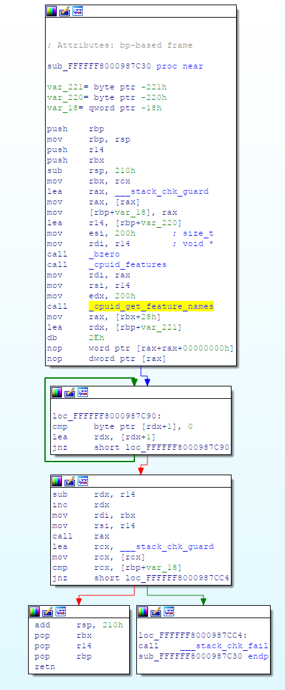
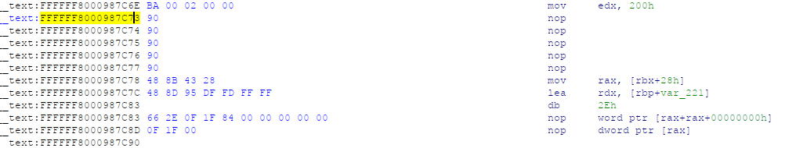

#### Problem

On a macOS virtual machine,

```
$ sudo /usr/bin/AssetCacheManagerUtil activate
AssetCacheManagerUtil[] Failed to activate content caching: Error Domain=ACSMErrorDomain Code=5 "virtual machine"...
```

It seems that the `Content Caching` functionality is not available when macOS
is running in a virtual machine. How can we enable this feature on our macOS
VM?


#### April 2020 Update

I was able to patch the Catalina 10.15.4 kernel to disable the VMM detection.

Original function:



Patched function:




```
static int
cpu_features SYSCTL_HANDLER_ARGS
{
    __unused struct sysctl_oid *unused_oidp = oidp;
    __unused void *unused_arg1 = arg1;
    __unused int unused_arg2 = arg2;
    char buf[512];

    buf[0] = '\0';
    // cpuid_get_feature_names(cpuid_features(), buf, sizeof(buf));
    cpuid_get_feature_names(cpuid_features(), buf, sizeof(buf)); // NOP this <-- NOTE!

    return SYSCTL_OUT(req, buf, strlen(buf) + 1);
}

...
"bsd/dev/i386/sysctl.c" 980 lines --13%--
```

See `bsd/dev/i386/sysctl.c 138: cpuid_get_feature_names(cpuid_features` too.

Useful commands:

```
sudo mount -uw /

sudo mv /System/Library/Kernels/kernel /System/Library/Kernels/kernel.bak

sudo kextcache -i /
```

Update: Use `resources/kernel_autopatcher.py` to patch your kernels! :-)


#### March 2020 Update

Update: This approach causes the macOS VM to consume multiple CPU(s) 100% on
the host!

See `osfmk/i386/tsc.c 142: if (cpuid_vmm_present()) {` for details.

Instead of trying to hack things from within the VM, we can turn off VMM
detection from the outside.

See [boot-macOS-Catalina.sh](./boot-macOS-Catalina.sh) to see how it is done.
Essentially, we add `hypervisor=off,vmx=on,kvm=off` flags to the QEMU's CPU
configuration.

Once this is done,

```
$ sysctl -a | grep VMM
<nothing>

$ sudo /usr/bin/AssetCacheManagerUtil activate
2020-03-14 19:05:21.416 AssetCacheManagerUtil[1313:53576] Content caching activated.
2020-03-14 19:05:21.417 AssetCacheManagerUtil[1313:53576] Restart devices to take advantage of content caching immediately

$ sudo /usr/bin/AssetCacheManagerUtil status
2020-03-14 19:10:31.154 AssetCacheManagerUtil[1362:54464] Content caching status: {
    Activated = 1;
    Active = 1;
    CacheDetails =     {
    };
    CacheFree = 119663451136;
    CacheLimit = 0;
    CacheStatus = OK;
    CacheUsed = 0;
    Parents =     (
    );
    Peers =     (
    );
    PersonalCacheFree = 119663451136;
    PersonalCacheLimit = 0;
    PersonalCacheUsed = 0;
    Port = 49363;
    PrivateAddresses =     (
        "192.168.100.137"
    );
    PublicAddress = "11.XX.YY.ZZ";
    RegistrationStatus = 1;
    RestrictedMedia = 0;
    ServerGUID = "XXX";
    StartupStatus = OK;
    TotalBytesAreSince = "2020-03-15 02:05:06 +0000";
    TotalBytesDropped = 0;
    TotalBytesImported = 0;
    TotalBytesReturnedToChildren = 0;
    TotalBytesReturnedToClients = 0;
    TotalBytesReturnedToPeers = 0;
    TotalBytesStoredFromOrigin = 0;
    TotalBytesStoredFromParents = 0;
    TotalBytesStoredFromPeers = 0;
}
```

w00t!

I found this technique from [this article](https://superuser.com/questions/1387935/hiding-virtual-machine-status-from-guest-operating-system). Thanks!

This was tested on macOS Mojave 10.14.6 and on macOS Catalina 10.15.3.


####  CPU flags

```
$ sysctl -a | grep VMM
machdep.cpu.features: FPU ... VMM PCID XSAVE OSXSAVE AVX1.0
```

Turning off `kvm=on` flag doesn't help in hiding the `VMM` flag.

https://github.com/hjuutilainen/adminscripts/blob/master/check-if-virtual-machine.py
uses the same trick to detect if macOS is running in a VM.


#### VM detection code in macOS

This code was found in the `AssetCache` binary.

```objective-c
char __cdecl -[ECConfig runningInVM](ECConfig *self, SEL a2)
{
  void *v2; // rax
  void *v3; // r15
  __int64 v4; // r13
  size_t v5; // r12
  __int64 v6; // r13
  int *v7; // rax
  char *v8; // rax
  bool v9; // bl
  __int64 v10; // r12
  __int64 v11; // r12
  int *v12; // rax
  char *v13; // rax
  __int64 v14; // rbx
  size_t v15; // rcx
  void *v16; // rax
  void *v17; // r14
  char result; // al
  __int64 *v19; // [rsp+0h] [rbp-40h]
  size_t v20; // [rsp+8h] [rbp-38h]
  __int64 v21; // [rsp+10h] [rbp-30h]

  v20 = 0LL;
  *__error() = 0;
  if ( sysctlbyname("machdep.cpu.features", 0LL, &v20, 0LL, 0LL) || v20 - 1 > 0xF423F )
  {
    v10 = qword_100394620;
    if ( (unsigned __int8)os_log_type_enabled(qword_100394620, 16LL) )
    {
      v11 = objc_retain(v10);
      v12 = __error();
      v13 = strerror(*v12);
      *((_DWORD *)&v19 - 8) = 134218242;
      *(__int64 **)((char *)&v19 - 28) = 0LL;
      *((_WORD *)&v19 - 10) = 2080;
      *(__int64 **)((char *)&v19 - 18) = (__int64 *)v13;
      _os_log_error_impl(&_mh_execute_header, v11, 16LL, aSysctlMachdepC, &v19 - 4, 22LL);
      objc_release(v11);
      v9 = 0;
      goto LABEL_21;
    }
LABEL_12:
    v9 = 0;
    goto LABEL_21;
  }
  v2 = malloc(v20);
  v3 = v2;
  if ( !v2 )
  {
    v14 = qword_100394620;
    if ( (unsigned __int8)os_log_type_enabled(qword_100394620, 16LL) )
    {
      v15 = v20;
      *((_DWORD *)&v19 - 4) = 134217984;
      *(__int64 **)((char *)&v19 - 12) = (__int64 *)v15;
      _os_log_error_impl(&_mh_execute_header, v14, 16LL, aOutOfMemoryLd, &v19 - 2, 12LL);
      v9 = 0;
      goto LABEL_21;
    }
    goto LABEL_12;
  }
  if ( sysctlbyname("machdep.cpu.features", v2, &v20, 0LL, 0LL) )
  {
    v4 = qword_100394620;
    if ( (unsigned __int8)os_log_type_enabled(qword_100394620, 16LL) )
    {
      v19 = (__int64 *)&v19;
      v5 = v20;
      v6 = objc_retain(v4);
      v7 = __error();
      v8 = strerror(*v7);
      *((_DWORD *)&v19 - 8) = 134218242;
      *(__int64 **)((char *)&v19 - 28) = (__int64 *)v5;
      *((_WORD *)&v19 - 10) = 2080;
      *(__int64 **)((char *)&v19 - 18) = (__int64 *)v8;
      _os_log_error_impl(&_mh_execute_header, v6, 16LL, aSysctlMachdepC, &v19 - 4, 22LL);
      objc_release(v6);
    }
    v9 = 0;
  }
  else
  {
    v16 = objc_msgSend(&OBJC_CLASS___NSString, "stringWithUTF8String:", v3);
    v17 = (void *)objc_retainAutoreleasedReturnValue(v16);
    v9 = (unsigned __int8)objc_msgSend(v17, "isEqualToString:", CFSTR("VMM"))
      || (unsigned __int8)objc_msgSend(v17, "hasPrefix:", CFSTR("VMM "))
      || (unsigned __int8)objc_msgSend(v17, "hasSuffix:", CFSTR(" VMM"))
      || (unsigned __int8)objc_msgSend(v17, "containsString:", CFSTR(" VMM "));
    objc_release(v17);
  }
  free(v3);
LABEL_21:
  result = __stack_chk_guard;
  if ( __stack_chk_guard == v21 )
    result = v9;
  return result;
}
```

The following code was found in `AssetCacheManagerService` binary,

```objective-c
char __cdecl -[ACMSManager _canActivateWithReason:](ACMSManager *self, SEL a2, id *a3)
{
  __int64 v3; // rax
  id *v4; // r14
  OS_os_log *v5; // rax
  __int64 v6; // rbx
  char v7; // bl
  __int64 v8; // r15
  struct objc_object *v9; // rax
  void *v10; // r12
  void *v11; // rax
  OS_os_log *v12; // rax
  __int64 v13; // rbx
  char result; // al
  __int64 v15; // [rsp+0h] [rbp-30h]

  v15 = v3;
  v4 = a3;
  if ( (unsigned __int8)-[ACMSManager runningInVM](self, "runningInVM", v3) )
  {
    v5 = -[ACMSManager logHandle](self, "logHandle");
    v6 = objc_retainAutoreleasedReturnValue(v5);
    if ( (unsigned __int8)os_log_type_enabled(v6, 0LL) )
    {
      *((_WORD *)&v15 - 8) = 0;
      _os_log_impl(&_mh_execute_header, v6, 0LL, aRunninginvm_2, &v15 - 2, 2LL);
    }
    objc_release(v6);
    if ( v4 )
    {
      objc_retainAutorelease(CFSTR("virtual machine"));
      *v4 = (id)CFSTR("virtual machine");
    }
    v7 = 0;
  }
  else
  {
    v8 = _kACSMSettingsDenyActivationKey;
    v9 = -[ACMSManager _managedPrefSettingForKey:](self, "_managedPrefSettingForKey:", _kACSMSettingsDenyActivationKey);
    v10 = (void *)objc_retainAutoreleasedReturnValue(v9);
    v11 = objc_msgSend(&OBJC_CLASS___NSNumber, "class");
    if ( !(unsigned __int8)objc_msgSend(v10, "isKindOfClass:", v11) )
    {
      objc_release(v10);
      v10 = 0LL;
    }
    if ( (unsigned __int8)objc_msgSend(v10, "boolValue") == 1 )
    {
      v12 = -[ACMSManager logHandle](self, "logHandle");
      v13 = objc_retainAutoreleasedReturnValue(v12);
      if ( (unsigned __int8)os_log_type_enabled(v13, 0LL) )
      {
        *((_DWORD *)&v15 - 4) = 138412290;
        *(__int64 *)((char *)&v15 - 12) = v8;
        _os_log_impl(&_mh_execute_header, v13, 0LL, asc_10000E438, &v15 - 2, 12LL);
      }
      objc_release(v13);
      if ( v4 )
      {
        objc_retainAutorelease(CFSTR("disabled by your system administrator"));
        *v4 = (id)CFSTR("disabled by your system administrator");
      }
      v7 = 0;
    }
    else
    {
      v7 = 1;
      if ( v4 )
        *v4 = 0LL;
    }
    objc_release(v10);
  }
  result = __stack_chk_guard;
  if ( __stack_chk_guard == v15 )
    result = v7;
  return result;
}
```

```objective-c
ACMSManager *__cdecl -[ACMSManager init](ACMSManager *self, SEL a2)
{
...
  if ( sysctlbyname("machdep.cpu.features", 0LL, &v59, 0LL, 0LL) || v59 - 1 > 0xF423F )
  {
    v33 = objc_msgSend(v26, "logHandle");
    v34 = objc_retainAutoreleasedReturnValue(v33);
    if ( (unsigned __int8)os_log_type_enabled(v34, 0LL) )
    {
      v35 = *__error();
      *((_DWORD *)&v45 - 8) = 134218240;
      *(__int64 *)((char *)&v45 - 28) = 0LL;
      *((_WORD *)&v45 - 10) = 1024;
      *(_DWORD *)((char *)&v45 - 18) = v35;
      _os_log_impl(&_mh_execute_header, v34, 0LL, aSysctlMachdepC, &v45 - 4, 18LL);
    }
    v36 = v34;
  }
  else
  {
    v27 = malloc(v59);
    v28 = v27;
    if ( v27 )
    {
      if ( sysctlbyname("machdep.cpu.features", v27, &v59, 0LL, 0LL) )
      {
        v29 = objc_msgSend(v26, "logHandle");
        v30 = objc_retainAutoreleasedReturnValue(v29);
        if ( (unsigned __int8)os_log_type_enabled(v30, 0LL) )
        {
          v58 = &v45;
          v31 = v59;
          v32 = *__error();
          *((_DWORD *)&v45 - 8) = 134218240;
          *(__int64 *)((char *)&v45 - 28) = v31;
          *((_WORD *)&v45 - 10) = 1024;
          *(_DWORD *)((char *)&v45 - 18) = v32;
          _os_log_impl(&_mh_execute_header, v30, 0LL, aSysctlMachdepC, &v45 - 4, 18LL);
        }
        objc_release(v30);
        v2 = v60;
      }
      else
      {
        v40 = ((__int64 (__fastcall *)(void *, const char *, void *))objc_msgSend)(
                &OBJC_CLASS___NSString,
                "stringWithUTF8String:",
                v28);
        v41 = objc_retainAutoreleasedReturnValue(v40);
        v42 = (void *)v41;
        v43 = ((__int64 (__fastcall *)(__int64, const char *, const __CFString *))objc_msgSend)(
                v41,
                "isEqualToString:",
                CFSTR("VMM"));
        v2 = v60;
        if ( v43
          || (unsigned __int8)objc_msgSend(v42, "hasPrefix:", CFSTR("VMM "))
          || (unsigned __int8)objc_msgSend(v42, "hasSuffix:", CFSTR(" VMM"))
          || (unsigned __int8)objc_msgSend(v42, "containsString:", CFSTR(" VMM ")) )
        {
          objc_msgSend(v26, "setRunningInVM:", 1LL);
        }
        objc_release(v42);
      }
      free(v28);
      goto LABEL_23;
    }
    v37 = objc_msgSend(v26, "logHandle");
    v38 = objc_retainAutoreleasedReturnValue(v37);
    if ( (unsigned __int8)os_log_type_enabled(v38, 0LL) )
    {
      v39 = v59;
      *((_DWORD *)&v45 - 4) = 134217984;
      *(__int64 *)((char *)&v45 - 12) = v39;
      _os_log_impl(&_mh_execute_header, v38, 0LL, aOutOfMemoryLd, &v45 - 2, 12LL);
    }
    v36 = v38;
  }
```

The `AssetCacheManagerService` binary seems to be our target.

I ran the following queries to spot these binaries,

```
$ find / -name "*AssetCache*" -exec grep -i "virtual machine" {} \; 2>/dev/null

$ find / -exec grep -Hn "ACSMErrorDomain" {} \; 2>/dev/null
```

Running `http://newosxbook.com/tools/XPoCe2.html` indicates that
`/usr/bin/AssetCacheManagerUtil` talks with `AssetCacheManagerService`.


After attaching `lldb` to `AssetCacheManagerService`,

```
$ nm AssetCacheManagerService | grep VM
000000010000bb97 t -[ACMSManager runningInVM]
000000010000bbaa t -[ACMSManager setRunningInVM:]
0000000100012928 s _OBJC_IVAR_$_ACMSManager._runningInVM

(lldb) break set --name '-[ACMSManager setRunningInVM:]'
Breakpoint 1: where = AssetCacheManagerService`-[ACMSManager setRunningInVM:], address = 0x0000000105bf5baa
(lldb) break set --name '-[ACMSManager _canActivateWithReason:]'
Breakpoint 2: where = AssetCacheManagerService`-[ACMSManager _canActivateWithReason:], address = 0x0000000105bf33f4
(lldb) break set --name '-[ACMSManager runningInVM]'
Breakpoint 3: where = AssetCacheManagerService`-[ACMSManager runningInVM], address = 0x0000000105bf5b97
Process 940 stopped
* thread #3, queue = 'com.apple.AssetCacheManagerService.ACMSManager.workQueue', stop reason = breakpoint 2.1
    frame #0: 0x0000000105bf33f4 AssetCacheManagerService`-[ACMSManager _canActivateWithReason:]
AssetCacheManagerService`-[ACMSManager _canActivateWithReason:]:
->  0x105bf33f4 <+0>: pushq  %rbp
    0x105bf33f5 <+1>: movq   %rsp, %rbp
    0x105bf33f8 <+4>: pushq  %r15
    0x105bf33fa <+6>: pushq  %r14
Target 0: (AssetCacheManagerService) stopped.
```


#### Fix ideas

* Patch `AssetCacheManagerService` binary?

* Kernel patching - change the way `sysctlbyname` behaves?

* Manipulate function execution using Frida?


#### Patch #1

")

After this binary patch is applied, `activation` seems to be working ;)

```
$ sudo /usr/bin/AssetCacheManagerUtil activate
... Failed to activate content caching: Error Domain=ACSMErrorDomain Code=3 "already activated"...
```

However, `sudo /usr/bin/AssetCacheManagerUtil status` fails to work just yet.

```
$ sudo /usr/bin/AssetCacheManagerUtil status
2018-11-10 19:29:24.051 AssetCacheManagerUtil[419:3473] Content caching status: {
    Activated = 0;
    Active = 0;
    CacheDetails =     {
    };
    CacheFree = 2000000000;
    CacheLimit = 2000000000;
    CacheStatus = OK;
    CacheUsed = 0;
    Parents =     (
    );
    Peers =     (
    );
    PersonalCacheFree = 2000000000;
    PersonalCacheLimit = 2000000000;
    PersonalCacheUsed = 0;
    Port = 0;
    RegistrationError = "NOT_ACTIVATED";
    RegistrationResponseCode = 403;
    RegistrationStatus = "-1";
    RestrictedMedia = 0;
    ServerGUID = "XXX";
    StartupStatus = FAILED;
    TotalBytesAreSince = "2018-11-11 03:27:25 +0000";
    TotalBytesDropped = 0;
    TotalBytesImported = 0;
    TotalBytesReturnedToChildren = 0;
    TotalBytesReturnedToClients = 0;
    TotalBytesReturnedToPeers = 0;
    TotalBytesStoredFromOrigin = 0;
    TotalBytesStoredFromParents = 0;
    TotalBytesStoredFromPeers = 0;
}
```

It seems more patching of the involved binaries (`/usr/libexec/AssetCache/AssetCache`) is required?

Note: The `AssetCacheManagerService.dif` included in this repository was
derived on a macOS 10.14.1 system.


#### Patch #2

Change the four `VMM` strings to `XXX` in the `/usr/libexec/AssetCache/AssetCache` binary.

```
$ pwd
/usr/libexec/AssetCache

$ sudo codesign --remove-signature AssetCache

$ sudo /usr/bin/AssetCacheManagerUtil status
2018-11-10 23:40:07.459 AssetCacheManagerUtil[973:21653] Content caching status: {
    Activated = 1;
    Active = 0;
    CacheDetails =     {
    };
    CacheFree = 2000000000;
    CacheLimit = 2000000000;
    CacheStatus = OK;
    CacheUsed = 0;
    Parents =     (
    );
    Peers =     (
    );
    PersonalCacheFree = 2000000000;
    PersonalCacheLimit = 2000000000;
    PersonalCacheUsed = 0;
    Port = 49181;
    RegistrationStarted = "2018-11-11 07:38:48 +0000";
    RegistrationStatus = 0;
    RestrictedMedia = 0;
    ServerGUID = "XXX";
    StartupStatus = PENDING;
    TotalBytesAreSince = "2018-11-11 07:38:48 +0000";
    TotalBytesDropped = 0;
    TotalBytesImported = 0;
    TotalBytesReturnedToChildren = 0;
    TotalBytesReturnedToClients = 0;
    TotalBytesReturnedToPeers = 0;
    TotalBytesStoredFromOrigin = 0;
    TotalBytesStoredFromParents = 0;
    TotalBytesStoredFromPeers = 0;
}
```

A bit of progress I think ;)

Note: However, it seems that more reversing and patching work is required.


#### Questions

* I haven't been able to see this `sysctlbyname("machdep.cpu.features"...` call
  being hit in `lldb`.

  Maybe this call is executed once at program startup?

* Can we use DTrace on macOS to trace execution of this call in a system-wide
  fashion?


### References

* https://geosn0w.github.io/Debugging-macOS-Kernel-For-Fun/

* https://www.hex-rays.com/wp-content/uploads/2019/12/xnu_debugger_primer.pdf
